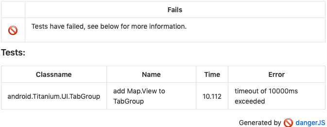

# danger-plugin-junit

[](https://travis-ci.org/sgtcoolguy/danger-plugin-junit)
[](https://badge.fury.io/js/danger-plugin-junit)


> Add your Junit XML test failures to Danger

## Usage

Install:

```sh
npm install danger-plugin-junit --save-dev
```

At a glance:

```js
// dangerfile.js
import junit from 'danger-plugin-junit'

async function main() {
	await junit({ reportPath: './build/reports/**/TESTS*.xml' })
}

main()
	.then(() => process.exit(0))
	.catch(err => {
		fail(err.toString());
		process.exit(1);
	});
```

The default `reportPath` is `'./build/reports/**/TESTS*.xml'`
The value is a [glob](https://www.npmjs.com/package/glob) path to gather up test results.

This plugin will only report test failures and errors. If any tests fail, it will report a single `fail()` message and record a table of the failed tests using `markdown()`.

An example of what is produced is below:


## Changelog

See the GitHub [release history](https://github.com/sgtcoolguy/danger-plugin-junit/releases).

## Contributing

See [CONTRIBUTING.md](CONTRIBUTING.md).
